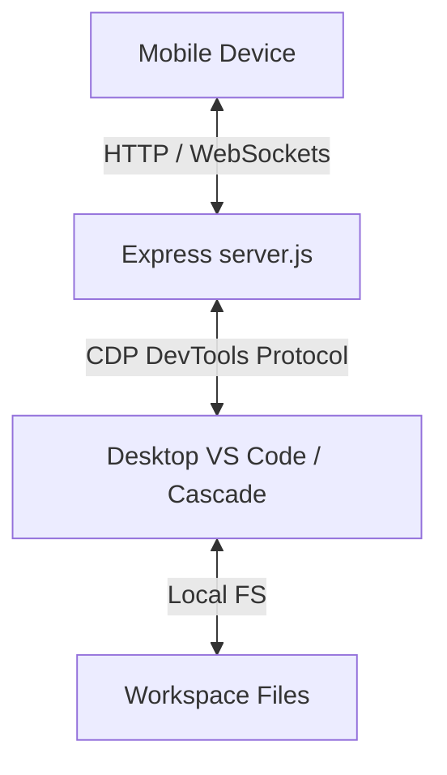

# Architecture: Antigravity Mobile Link Headless Mirroring

This document describes the design architecture of the **Antigravity Mobile Link** app.

---

## 1. Overview
The Antigravity Mobile Link app mirrors the active AI chat panel inside the desktop IDE (VS Code/Cascade) onto a mobile browser. It enables developers to read thoughts, review proposed modifications (diffs), allow/deny commands, and send messages directly from their phone over Wi-Fi.

---

## 2. Headless Mirroring via CDP
The server discovers and hooks into the IDE's running browser instance using the **Chrome DevTools Protocol (CDP)**.

1. **Port Discovery:** The server scans ports `9000-9003` (where VS Code's remote debugging/CDP instance runs) by querying `http://127.0.0.1:<port>/json/list`.
2. **Context Selection:** It locates the `workbench.html` or `Jetski/Launchpad` frame context.
3. **DOM Scraping Heuristics:**
   - Evaluates a client-side Javascript expression inside the target context to extract the `#conversation` container.
   - Cleans the DOM tree: strips the desktop input editor, contenteditable blocks, and floating desktop tooltips to prevent UI clutter on mobile.
   - Performs a final narrow composer scrub for current Antigravity side-panel input variants (`antigravity.agentSidePanelInputBox`, `aria-label="Message input"`, and combobox editors) immediately before snapshot serialization.
   - Isolates invalid selector failures inside each cleanup query so one unsupported selector cannot abort the remaining scrub passes.
   - Converts local asset images (served via `vscode-file:` paths) into base64 Data URLs so they render correctly on the mobile device.
   - Evaluates history opening and history scraping as separate short CDP calls, so a workbench context rebuild after clicking history cannot hang the mobile `/chat-history` request.
4. **WebSocket Broadcast:** When DOM modifications are detected, the server computes a string hash of the HTML. If the hash changes, it broadcasts a notification to all connected mobile clients over WebSockets to trigger a reload of the snapshot.

---

## 3. UI/UX Custom Style Overrides
To provide a premium space-black interface, the mobile client injects custom CSS overrides on top of the mirrored layout rules.
* Sets all background canvases to space-black (`#000000`).
* Resets fonts to a cohesive font system (Outfit for controls/headings, Inter for chat bubbles, JetBrains Mono for code blocks).
* Wraps thinking logs (`.thought`, `.thinking`) in collapsible card panels.
* Programmatically maps standard action buttons (Allow/Deny, Apply/Discard) to flat blunt-vertices (`border-radius: 6px`) controls.

---

## 4. Reorganized Repository Layout
To make the workspace production-grade, all core scripts have been structured out of the root directory:

* `/src/`: Contains backend logic, express routing, and UI inspection tools.
* `/public/`: Houses the static HTML/CSS/JS frontend assets.
* `/scripts/`: Holds environment launchers, shortcut forwarding scripts, and certificate generators.
* `/tests/`: Holds unit tests and mock HTML files.
* `/docs/`: Stores architecture specifications and decisions.

---

## 5. 2026-06-23 Conversation Loading Fix

The root cause of the blank mobile conversation view was a nested escaping bug in `captureSnapshot()`: `rules.join('\n')` inside the outer template literal generated an invalid CDP evaluation script, causing `SyntaxError: Invalid or unexpected token` in every workbench context. The snapshot function now emits `rules.join('\\n')`, preserving valid JavaScript for runtime evaluation.

The history drawer hang was caused by clicking the desktop history control and waiting for the resulting panel inside the same long `Runtime.evaluate` promise. Antigravity can rebuild or refresh the workbench context after that click, leaving the CDP call unresolved until timeout. The endpoint now opens history synchronously, then polls fresh contexts with short bounded evaluations and scrapes only the resolved panel.

Regression coverage lives in `tests/test_scraping.js` and is available through `npm test`.

---

## 6. 2026-06-23 Antigravity Feature Research

Official Antigravity material describes the IDE as an agent-first coding environment with a Manager surface, Editor surface, integrated terminal, embedded browser support, artifacts/plans, model selection, and MCP connectivity. The mobile link should expose these as user-editable toggles only when they can be detected or safely proxied from the desktop IDE:

* [[ADR 01 - Revert and Tagging]] stays responsible for file, folder, skill, and MCP tagging behavior.
* [[ADR 02 - CDP Snapshot and History Resilience]] stays responsible for the runtime DOM and chat-history bridge.
* Candidate mobile toggles: conversation history, model display, thinking cards, artifact/plan visibility, browser/preview visibility, diff/action controls, workspace quick-pick controls, skills, and MCP servers.
* Avoid hardcoding model names or Antigravity-only capabilities from stale docs. Prefer live DOM detection, `/api/settings`, and user-editable config entries.

Primary research links:

* https://antigravity.google/docs/home
* https://antigravity.google/docs/mcp
* https://blog.google/technology/developers/google-antigravity/
